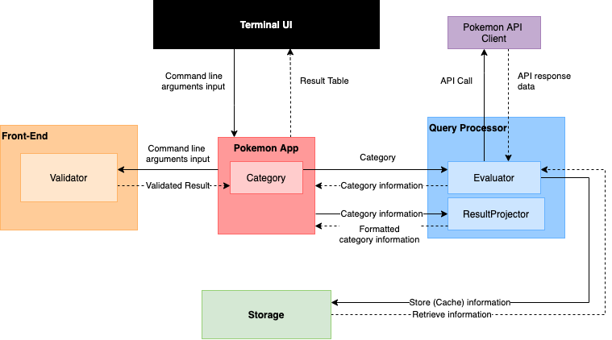
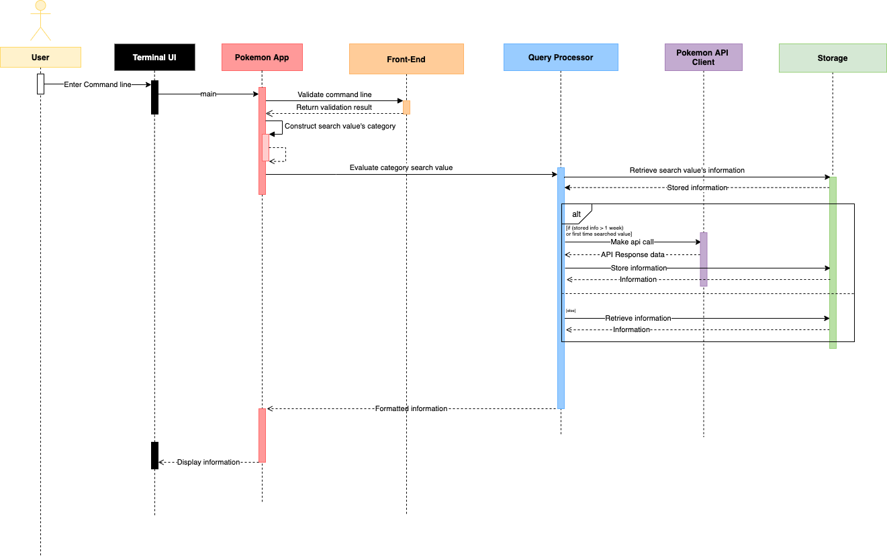
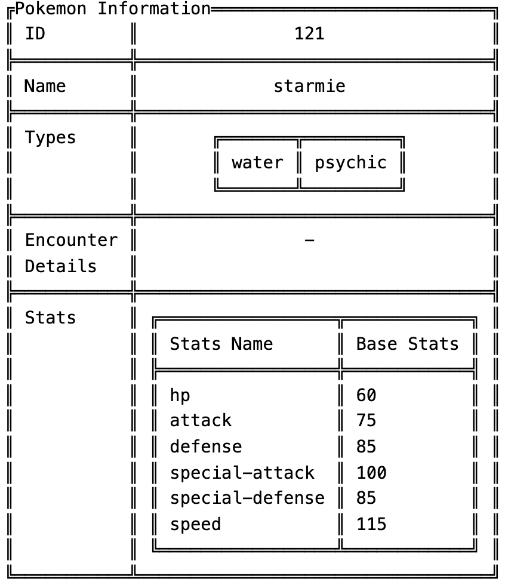

# TakeHome_RachelTanXueQi_25Feb2020

# About
A terminal application to retrieve data about the Pokemon when queried.
The program has the following functionality:
- Ability to cache the stored information locally (using a text file)
- Ability to search by Pokemon Name or ID.
- Display​ only​ the following information
    - Pokemon ID
    - Pokemon Name
    - Pokemon Type(s)
    - Pokemon Encounter Location(s) and method(s) in ​Kanto​ only
        - If there are no encounter location in Kanto, display ‘-’ Pokemon stats (speed, def, etc etc)
- If the stored information is over a week old, the data should be retrieved again from the API. If not, the data should be retrieved from the text file

## System Architecture 

## Sequence Diagram

## Design Decisions

### DD1: Deciding on storage of information fetched from api
- Option 1: Store raw data fetch from api call
- Option 2: Process raw data fetch from api call to strip redundant fields and store

|    | Option 1 | Option 2 |
|-|----------|---------|
| Better time complexity for reading from cache| | :heavy_check_mark: |
| Better extendability for faster reading from cache and display other info  (possible enhancement)| :heavy_check_mark: | |
| Smaller storage space (better space complexity) | |:heavy_check_mark:|

### DD2: Deciding on overall storage schema

- Option 1: Coding style and storage schema is extensible 

    To allow making api call and storing of response from `pokemon/name` and `pokemon/id` as well as in the future, more search options`ability/id`, `types/id`
    - First layer key is the category, pokemon for now and future, could including key such as ability or types
    - Second layer key is the searched value. With the assumption that searching via name and id returns the same data content, I will just both name and id as the keys regardless of the searched value is a name or id. This is the reduce the number of api call of the same content.
    - The final layer which is the second layer key's value consists of a dictionary of the information I am storing. This consists of `last_stored_value`, processed `data` which is discussed in DD1.

- Option 2: Specific to just fetch data from `pokemon/name` and  `pokemon/id` and storing to storage.
    - Easy implementation but not very extensible for future features

# Project Dependencies
This project is done in `python version 3.7` with macOS.

Make you sure you have the python version installed or visit https://www.python.org/downloads/ and follow the documentation for python installation.

It uses a few open source project to run:
- certifi==2020.12.5
- chardet==4.0.0
- idna==2.10
- importlib-metadata==3.7.0
- requests==2.25.1
- rope==0.18.0
- terminaltables==3.1.0
- typing-extensions==3.7.4.3
- urllib3==1.26.3
- zipp==3.4.0

# Installation and Setup Guide
#### 1. Open Terminal 
#### 2. Change the current working directory to the location where you want the cloned directory.

#### 3. Type git clone, and then paste this git project URL.
    git clone https://github.com/racheltanxueqi/TakeHome_RachelTanXueQi_25Feb2020.git

#### 4. Once completed, run the following command to install the dependencies. 

    pip install requirements.txt

# Running the Terminal Application
#### Once all the setup has been done, you may
#### 1. Go to `src/` direction

    cd src/

#### 2. Input the command line in the following format:
    
    python pokemon_app.py -p yourSearchValue

    
`yourSearchValue can be pokemon name or id`

#### 3. View the displayed information

`Sample Test result`

Input to terminal:

    python pokemon_app.py -p 121

Output in terminal:

